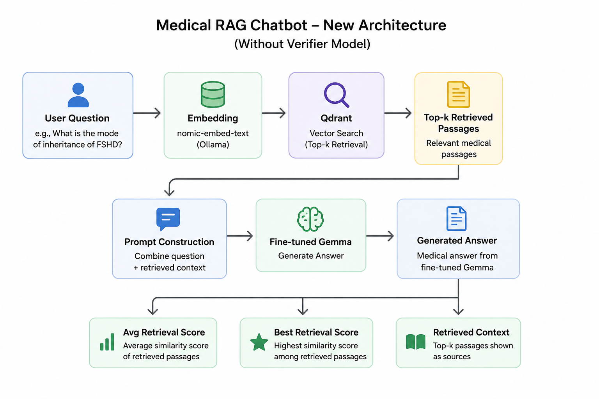

# Med AI UI

[](https://youtu.be/_IC34JoNLaU)

A local medical RAG chatbot built with Streamlit. It combines:

- your fine-tuned model served through a `/generate/` endpoint, including an ngrok public tunnel if you want remote access
- a local Qdrant vector store for retrieval over `corpus.parquet`
- Ollama embeddings for indexing and retrieval
- LangChain prompt orchestration with streamed answers in a chat-style Streamlit interface
- Get Overall and average retrieval score against each retrieved passage IDs

The app runs locally and does not require an API key. You only need Ollama running on your machine for embeddings.

## What You Need

- Python 3.10+
- The project virtual environment in `.venv310/`
- Ollama installed and running locally
- The embedding model pulled in Ollama, by default `nomic-embed-text`
- A generation endpoint that accepts POST requests at `/generate/` with `prompt` and `max_length`

## Run Locally

1. Open a terminal in the project folder:

   ```powershell
   cd D:\med-ai-ui
   ```

2. Activate the project virtual environment:

   ```powershell
   .\.venv310\Scripts\Activate.ps1
   ```

3. Install the Python dependencies:

   ```powershell
   pip install -r requirements.txt
   ```

4. Start Ollama in a separate terminal if it is not already running.

5. Pull the embedding model and verification model used by the app:

   ```powershell
   ollama pull nomic-embed-text
   ollama pull hf.co/MoMonir/Llama3-OpenBioLLM-8B-GGUF:Q4_K_M
   ```

6. Start your model server. If you are exposing it through ngrok, copy the public `/generate/` URL.

7. Start the Streamlit app:

   ```powershell
   streamlit run app.py
   ```

8. Open the local URL shown in the terminal, usually:

   ```text
   http://localhost:8501
   ```

## How It Works



## Notes

- If Ollama is not reachable at `http://localhost:11434`, update the Ollama base URL in the app sidebar.
- If your generation server is exposed over ngrok, paste the public `/generate/` URL into the sidebar's generation endpoint field.
- If you want to rebuild the vector index, use the "Rebuild Qdrant index" button in the sidebar.
- The first launch may take a little longer because the model and vector index need to load.
